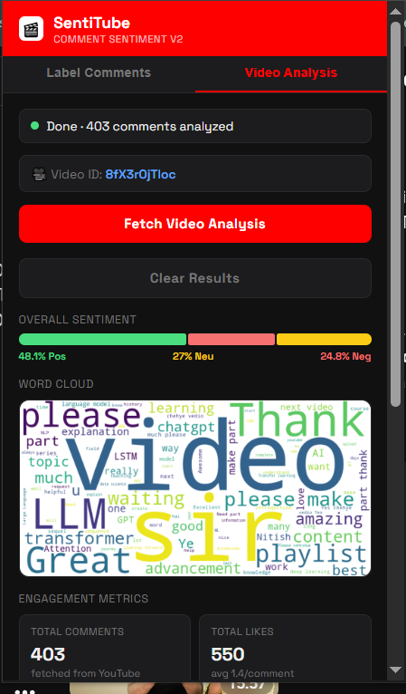
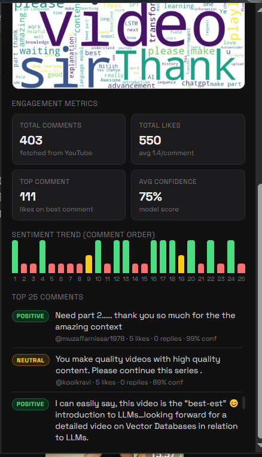

# youtube_comment_analysis

--------

## 🚀 Project Overview

**SentiTube v3** is a production-grade sentiment analysis ecosystem designed to provide real-time insights into YouTube comment sections. Unlike standard analysis scripts, this project features a fully automated MLOps pipeline that manages the entire lifecycle from data ingestion to cloud deployment.

The system consists of two primary components:
1.  **Backend (This Repo)**: A containerized FastAPI service serving a high-performance LightGBM model, managed with DVC, MLflow, and deployed on AWS.
2.  **Frontend**: A Chrome Extension that interacts with the YouTube DOM to label comments and provide deep-dive analytics.

**Frontend Repository**: [YouTube Sentiment Analysis Chrome Extension](https://github.com/rahulnamilakonda/youtube-sentiment-analysis-chrome-extension)

---

## ✨ Key Features

*   **Real-time Sentiment Labeling**: Automatically categorizes visible YouTube comments into Positive, Negative, or Neutral directly in your browser.
*   **Video-Level Deep Dive**: Summarizes thousands of comments into actionable metrics, including engagement stats and trend analysis.
*   **Automated MLOps Pipeline**: Features "Fail-Fast" quality gates, model signature verification, and automated promotion to production.
*   **Word Cloud Generation**: Dynamic server-side generation of comment word clouds for visual topic modeling.

---

## 📸 Screenshots

### 1. In-Page Comment Labeling
Automatically injects sentiment badges into the YouTube UI based on model predictions.


### 2. Video Analysis Dashboard
A comprehensive popup UI showing sentiment distribution, engagement metrics, and sentiment trends.


### 3. Visual Topic Modeling
Integrated Word Cloud generation to identify the most discussed topics in the comment section.


---

## 🛠 Tech Stack

*   **Machine Learning**: LightGBM, Scikit-Learn, Optuna (Bayesian Optimization).
*   **MLOps & DevOps**: DVC (Data Version Control), MLflow (Model Registry & Tracking), GitHub Actions (CI/CD), Docker.
*   **Backend**: FastAPI, Gunicorn, Uvicorn, Pydantic v2.
*   **Cloud (AWS)**: EC2, S3, CodeDeploy, Auto Scaling.
*   **Frontend**: JavaScript (Chrome Extension MV3), HTML/CSS.

---

## 🏗 Industrial Pipeline Architecture
The project follows a strict sequential gate system:
1.  **Data Versioning**: DVC manages multi-dataset merging (Reddit + Twitter).
2.  **Technical Gate**: Automated verification of model input schemas using MLflow Signatures.
3.  **Performance Gate**: Enforcement of a >85% Accuracy threshold for production promotion.
4.  **Deployment Gate**: Multi-stage Docker builds pushed to Docker Hub and deployed via AWS CodeDeploy.

---

## 📂 Project Organization

```
├── LICENSE            <- Open-source license if one is chosen
├── Makefile           <- Makefile with convenience commands like `make data` or `make train`
├── README.md          <- The top-level README for developers using this project.
├── data
│   ├── external       <- Data from third party sources.
│   ├── interim        <- Intermediate data that has been transformed.
│   ├── processed      <- The final, canonical data sets for modeling.
│   └── raw            <- The original, immutable data dump.
│
├── docs               <- A default mkdocs project; see www.mkdocs.org for details
│
├── models             <- Trained and serialized models, model predictions, or model summaries
│
├── notebooks          <- Jupyter notebooks. Naming convention is a number (for ordering),
│                         the creator's initials, and a short `-` delimited description, e.g.
│                         `1.0-jqp-initial-data-exploration`.
│
├── pyproject.toml     <- Project configuration file with package metadata for 
│                         youtube_comment_analysis and configuration for tools like black
│
├── references         <- Data dictionaries, manuals, and all other explanatory materials.
│
├── reports            <- Generated analysis as HTML, PDF, LaTeX, etc.
│   └── figures        <- Generated graphics and figures to be used in reporting
│
├── requirements.txt   <- The requirements file for reproducing the analysis environment, e.g.
│                         generated with `pip freeze > requirements.txt`
│
├── setup.cfg          <- Configuration file for flake8
│
└── youtube_comment_analysis   <- Source code for use in this project.
    │
    ├── __init__.py             <- Makes youtube_comment_analysis a Python module
    │
    ├── config.py               <- Store useful variables and configuration
    │
    ├── dataset.py              <- Scripts to download or generate data
    │
    ├── features.py             <- Code to create features for modeling
    │
    ├── modeling                
    │   ├── __init__.py 
    │   ├── predict.py          <- Code to run model inference with trained models          
    │   └── train.py            <- Code to train models
    │
    └── plots.py                <- Code to create visualizations
```

